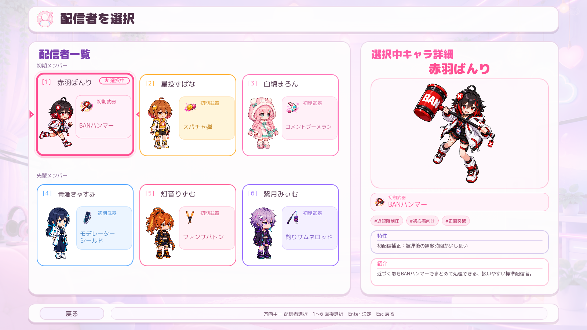
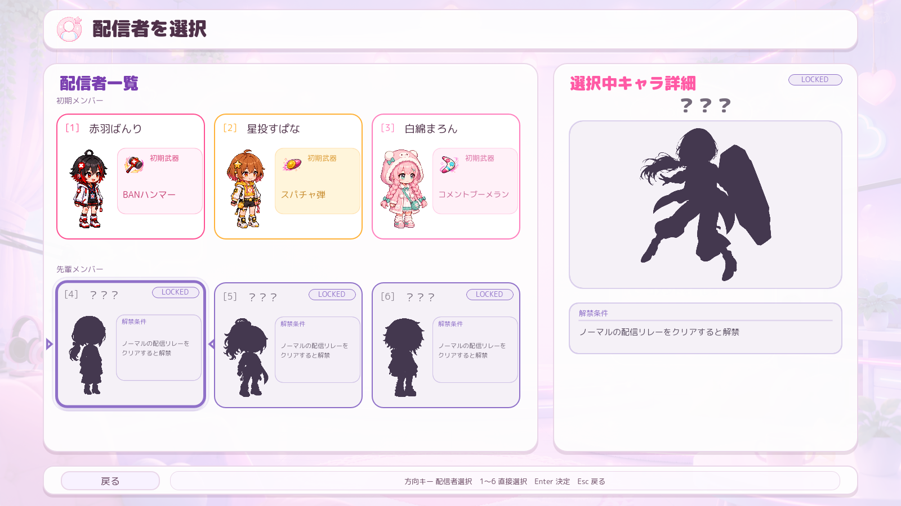
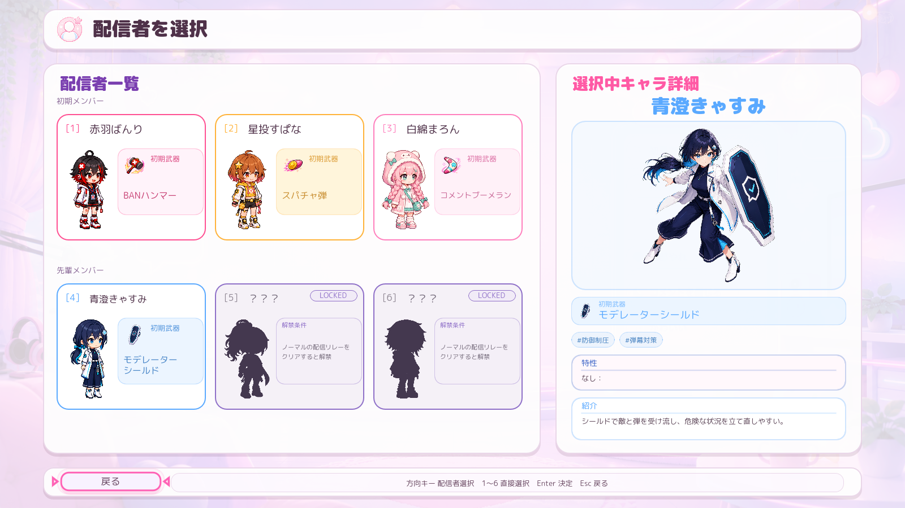

# 配信者選択画面 最終監査レポート

- 監査日: 2026-08-16
- 基準解像度: 1600×900
- 判定: **PASS — UI改修完了としてよい**
- 実装依頼: **なし**（完了を妨げる不具合を検出しなかったため）

## 総合判定

最終チェックリストの必須項目を、実画面キャプチャ、フレーム差分、レイアウト自動テスト、入力・解禁フロー自動テスト、コード照合で確認した。重大な表示崩れ、操作不能、秘匿情報の露出、解禁後のロック状態残留は確認されなかった。

この画面は一旦完成扱いとし、今後は明確な表示崩れ・操作不具合・全画面共通監査での不統一が見つかった場合のみ再度修正する方針でよい。

## チェック結果

| 対象 | 判定 | 確認内容 |
|---|---|---|
| 3列×2段／グループ | PASS | 初期メンバー3人、先輩メンバー3人が同サイズカードで明確に分かれ、見出しも過剰でない。 |
| 解禁済み左カード | PASS | 番号、名前、歩行グラ、初期武器、選択状態だけを表示。タグ・特性・紹介文は非表示。 |
| 歩行グラ | PASS | 非選択はメインゲームの直立画像で静止。選択中だけ8fpsでその場歩行し、足元基準も6人で一致。 |
| 選択状態 | PASS | 太枠、淡いTint、左右マーカー、`★ 選択中`、歩行で1枚だけ明確に判別できる。 |
| 初期武器欄 | PASS | 6種すべてアイコンと名前を判別可能。長名は14px以上、最大2行で欠落・はみ出しなし。 |
| 右詳細（通常） | PASS | 名前、立ち絵、初期武器、タグ、特性、紹介を表示し、左＝選択／右＝詳細の役割が成立。 |
| 左カード（未解禁） | PASS | 番号、`？？？`、`LOCKED`、単色シルエット、解禁条件だけを表示。実名・武器・タグは非表示。 |
| 右詳細（未解禁） | PASS | `？？？`、`LOCKED`、大きな単色シルエット、解禁条件だけを表示。秘匿項目の残留なし。 |
| 未解禁アニメ | PASS | 選択中でもアバターは静止。フレーム差分で画像領域の変化0を確認。 |
| 解禁後切替 | PASS | 解禁プロフィール適用後に実名・歩行グラ・初期武器・通常詳細へ復帰し、ロック情報は残留しない。 |
| 方向キー | PASS | 1↔2↔3、4↔5↔6、1↔4、2↔5、3↔6。外周では不自然な折返しなし。 |
| 1～6直接選択 | PASS | 6キーすべて対応IDへ一致し、解禁済みなら決定処理へ進む。 |
| Enter／Esc／未解禁決定 | PASS | Enterは解禁済みだけ決定、未解禁はカーソル更新のみ。Escはタイトルへ戻る。 |
| 戻る／操作ガイド | PASS | 戻るのキーフォーカスが明確。画面下部文言と実装入力が一致。 |
| 1600×900 | PASS | カード、文字、武器欄、シルエット、右詳細、フッターに切れ・重なりなし。 |
| 動作負荷 | PASS | 時間差分で選択中カードのみ変化。他5カードと未解禁アバターは静止。 |

## 実画面エビデンス

### 解禁済み・通常選択

### 未解禁・専用表示

### 解禁直後の即時切替

### 戻るボタンのキーフォーカス

## フレーム差分

- 解禁済み・ばんり: 0.125秒差で選択中アバター領域に6,909pxの変化。他5カードは実質0px。
- 未解禁・きゃすみ: 0.125秒差でアバター領域・右シルエット・右詳細は0px。変化はカード外の選択マーカーのみ。

比較元:

- `01-unlocked-selected-banri-frame0.png` / `02-unlocked-selected-banri-frame1.png`
- `04-locked-selected-kyasumi-frame0.png` / `05-locked-selected-kyasumi-frame1.png`

## 自動テスト

- `CHARACTER_SELECT_UI_LAYOUT_TESTS: PASS`
  - 配置、余白、文字収まり、武器6種、ロック秘匿、単色シルエット、8fps、足元位置、3×2移動、1～6割当を検証。
- `CHARACTER_SELECT_BEHAVIOR_AUDIT: PASS`
  - Enter、Esc、1～6、未解禁決定拒否、ノーマル配信リレー完走による先輩3人の解禁・再読込・重複解禁防止を検証。

参考として既存のパワーアップショップ全体テストも実行したが、`buzz_keep values` と `gift reroll values` の2件が失敗した。対象のJSON値自体はどちらも `[0, 1, 2, 3, 4, 5]` であり、今回の配信者選択UIおよび先輩メンバー解禁フローの対象テストは通過しているため、本画面の完了判定には含めない。

## 完了を妨げない観察

- 青澄きゃすみの右詳細で特性名がない場合に `なし：` と表示される。情報欠落や操作不具合ではなく、今回の完了条件外の軽微な文言表現であるため、追加修正は指示しない。
- Canvas描画UIのため、スクリーンリーダー等の支援技術対応は画像・キーボード監査だけでは判定できない。今回の完了判定は、提示されたチェックリスト範囲に限る。
